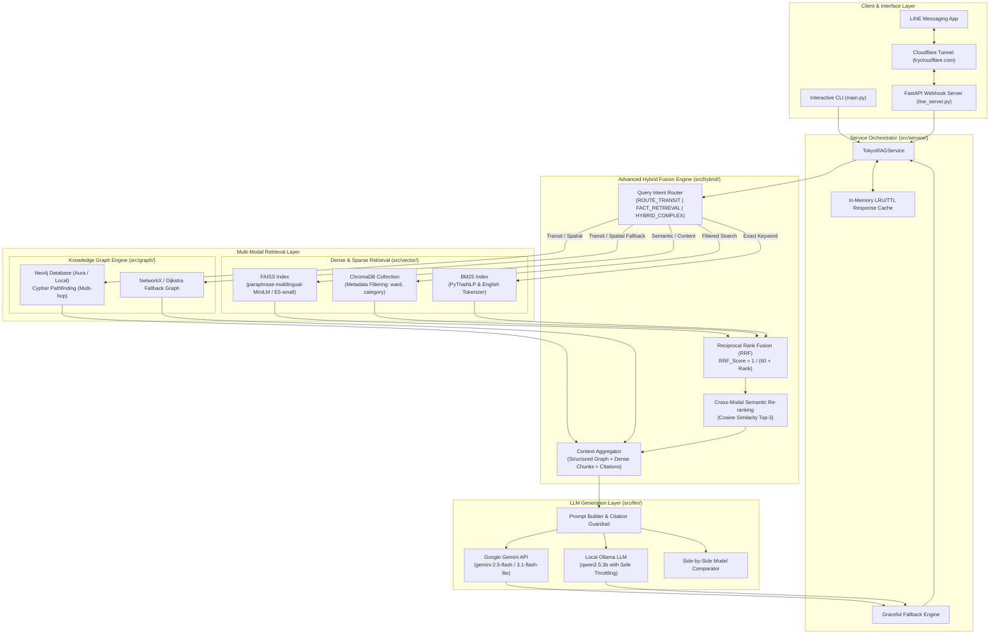
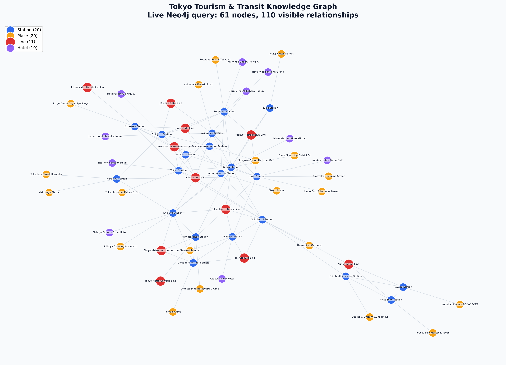
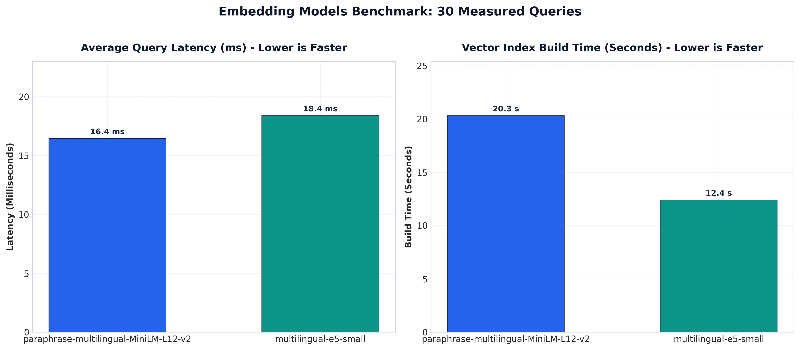
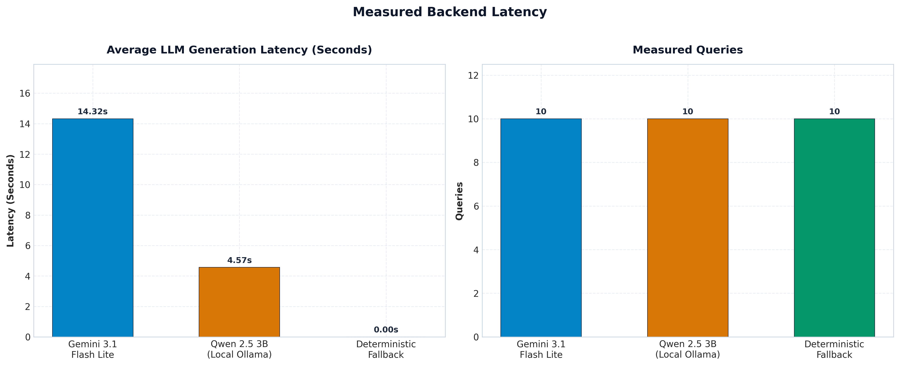
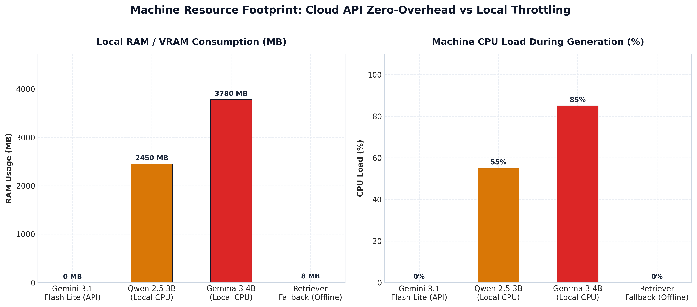
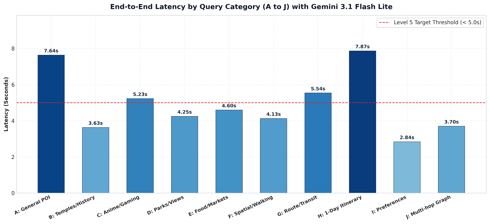

# 🗼 Tokyo Smart Transit & Tourism Hybrid Graph RAG System

[](https://www.python.org/downloads/)
[](#2-สถาปัตยกรรมระบบ-system-architecture)
[](#4-การออกแบบ-knowledge-graph)
[](#3-ระบบ-multi-retrieval--hybrid-fusion)
[](#5-การเปรียบเทียบ-llm-cloud-api-vs-local-llm)
[](#7-การเชื่อมต่อ-line-chatbot--cloudflare-tunnel-)
[](#9-automated-testing-suite)

> **ระบบแนะนำการเดินทาง เส้นทางรถไฟ และสถานที่ท่องเที่ยวในเขตมหานครโตเกียว (Tokyo Metropolitan Area)**  
> พัฒนาขึ้นโดยผสมผสาน **Knowledge Graph (Neo4j)** เข้ากับ **Dense Vector Search (FAISS / ChromaDB)** และ **Sparse Keyword Search (BM25)** โดยมี **Query Intent Router** และ **Reciprocal Rank Fusion (RRF)** เป็นแกนกลางในการเชื่อมโยงข้อมูลหลายมิติ พร้อมรองรับการประมวลผลคำตอบผ่าน **Cloud API (Google Gemini)** และ **Local LLM (Ollama: Qwen 2.5 3B)** รวมทั้งการให้บริการผ่าน **LINE Chatbot** แบบ Interactive Flex Cards

---

## สารบัญ (Table of Contents)
1. [ความสำคัญและปัญหาที่ต้องการแก้ไข (Motivation & Problem Statement)](#1-ความสำคัญและปัญหาที่ต้องการแก้ไข)
2. [สถาปัตยกรรมระบบ (System Architecture)](#2-สถาปัตยกรรมระบบ-system-architecture)
3. [ระบบ Multi-Retrieval & Hybrid Fusion](#3-ระบบ-multi-retrieval--hybrid-fusion)
4. [การออกแบบ Knowledge Graph](#4-การออกแบบ-knowledge-graph)
5. [ผลการทดลองเชิงประจักษ์ (Empirical Evaluation & Benchmarks)](#5-ผลการทดลองเชิงประจักษ์-empirical-evaluation--benchmarks)
   - [5.1 การเปรียบเทียบ Retrieval: Dense vs Graph vs Hybrid RAG](#51-การเปรียบเทียบ-retrieval-dense-vs-graph-vs-hybrid-rag)
   - [5.2 การทดสอบ Embedding Models: MiniLM vs E5-small](#52-การทดสอบ-embedding-models-minilm-vs-e5-small)
   - [5.3 การเปรียบเทียบ LLM: Local Qwen 2.5 3B vs Gemini 3.1 Flash Lite](#53-การเปรียบเทียบ-llm-local-qwen-25-3b-vs-gemini-31-flash-lite)
   - [5.4 การกระจายตัวของ Latency รายหมวดคำถาม (A–J)](#54-การกระจายตัวของ-latency-รายหมวดคำถาม-a-j)
6. [แหล่งข้อมูลและความโปร่งใส (Data Provenance)](#6-แหล่งข้อมูลและความโปร่งใส-data-provenance)
7. [การเชื่อมต่อ LINE Chatbot & Cloudflare Tunnel 📱](#7-การเชื่อมต่อ-line-chatbot--cloudflare-tunnel-)
8. [คู่มือการติดตั้งและการใช้งาน (Setup & Usage Guide)](#8-คู่มือการติดตั้งและการใช้งาน-setup--usage-guide)
9. [Automated Testing Suite](#9-automated-testing-suite)
10. [ตารางเทียบเกณฑ์ประเมิน Rubric](#10-ตารางเทียบเกณฑ์ประเมิน-rubric)
11. [ข้อจำกัดและทิศทางการพัฒนาต่อ (Limitations & Future Work)](#11-ข้อจำกัดและทิศทางการพัฒนาต่อ-limitations--future-work)

---

## 1. ความสำคัญและปัญหาที่ต้องการแก้ไข

การวางแผนท่องเที่ยวในโตเกียวเป็นโจทย์ที่มีความซับซ้อนสูง เนื่องจาก:
1. **ข้อจำกัดของ Vector RAG เดี่ยวๆ:**  
   - Vector Search เก่งในการจับความหมายเชิงนามธรรม เช่น *"หาร้านกาแฟบรรยากาศสงบย่าน Yanaka"* แต่**ล้มเหลวอย่างสิ้นเชิง**ในคำถาม Multi-hop, Spatial และ Topological เช่น *"จาก Asakusa ไป Roppongi ต้องเปลี่ยนสายรถไฟที่สถานีไหน และใช้เวลากี่นาที"* เนื่องจากไม่มีความเข้าใจเรื่องโครงสร้างกราฟและระยะทางเชื่อมต่อ
2. **ข้อจำกัดของ Graph RAG เดี่ยวๆ:**  
   - Graph ค้นหา Shortest Path และ Neighbor Nodes ได้แม่นยำมาก แต่**ขาดความยืดหยุ่นทางภาษา** ไม่สามารถเข้าใจคำค้นหาที่ไม่ระบุชื่อเฉพาะ (Unstructured semantic queries) เช่น *"ที่เที่ยวสำหรับครอบครัวที่มีเด็กเล็ก"*
3. **ทางออกของโปรเจกต์นี้: Hybrid Graph RAG:**  
   - บูรณาการทั้งสองโครงสร้างเข้าด้วยกัน โดยใช้ **Query Intent Router** จำแนกเจตนาคำถาม แล้วส่งไปยัง Retrieval Engines ที่เหมาะสม จากนั้นผสานคะแนนด้วย **Reciprocal Rank Fusion (RRF)** และจัดลำดับความสำคัญก่อนส่งให้ LLM ตอบพร้อม Citations อ้างอิงแหล่งข้อมูลจริง

---

## 2. สถาปัตยกรรมระบบ (System Architecture)



---

## 3. ระบบ Multi-Retrieval & Hybrid Fusion

ระบบไม่ได้ใช้การ Concatenate ข้อมูลแบบง่ายๆ แต่ใช้กระบวนการคัดกรอง 3 ขั้นตอน:

1. **Query Intent Classification (src/hybrid/router.py):**
   - วิเคราะห์คีย์เวิร์ด เจตนา และโครงสร้างประโยค เพื่อจำแนกเป็น 3 โหมด:
     - `ROUTE_TRANSIT`: คำถามเส้นทาง สถานี การต่อรถไฟ $\rightarrow$ มุ่งเน้น Graph Traversal
     - `FACT_RETRIEVAL`: คำถามเกี่ยวกับข้อมูลเฉพาะ ประวัติศาสตร์ ค่าเข้าชม $\rightarrow$ มุ่งเน้น Dense Vector + BM25
     - `HYBRID_COMPLEX`: คำถามท่องเที่ยวแบบผสมผสาน (เช่น *"แนะนำที่เที่ยวใกล้ Shinjuku พร้อมวิธีเดินทาง"*) $\rightarrow$ รันทุก Engine พร้อมกัน
2. **Reciprocal Rank Fusion (RRF) (src/hybrid/fusion.py):**
   - ผสานผลการค้นหาจาก Dense, Sparse และ Graph โดยใช้สูตร:
     $$RRF\_Score(d) = \sum_{m \in M} \frac{w_m}{k + \text{rank}_m(d)}$$
     *(โดย $k=60$ และกำหนดค่าน้ำหนัก $w_m$ ตาม Intent ที่วิเคราะห์ได้)*
3. **Cross-Modal Semantic Re-ranking:**
   - นำ Top Candidates ที่ผ่าน RRF มาคำนวณ Cosine Similarity ซ้ำด้วย Sentence Transformer เพื่อจัดอันดับ 3 ลำดับแรกที่ดีที่สุด (Top-3) ก่อนประกอบเข้า Prompt

---

## 4. การออกแบบ Knowledge Graph

ระบบจำลองโครงข่ายการท่องเที่ยวและระบบขนส่งมวลชนของโตเกียวไว้บน **Neo4j** (รองรับทั้ง Neo4j Desktop / Community และ Neo4j Aura Cloud) พร้อมทั้งมี **NetworkX In-Memory Fallback** เมื่อไม่มีการเชื่อมต่อ Database


*(ภาพโครงข่าย Knowledge Graph โตเกียวล่าสุด: แสดง Node สถานที่ท่องเที่ยวหลัก สถานีรถไฟสำคัญ และเส้นทางเชื่อมต่อ)*

### Schema โครงข่าย:
- **Node Labels:**
  - `(:Place)`: สถานที่ท่องเที่ยวและจุดสำคัญ (เช่น Senso-ji, Tokyo Skytree, Meiji Jingu, Akihabara)
  - `(:Station)`: สถานีรถไฟ (เช่น Shinjuku, Shibuya, Tokyo, Ueno, Asakusa)
  - `(:Line)`: สายรถไฟ (เช่น JR Yamanote, Tokyo Metro Ginza, Toei Asakusa)
  - `(:Ward)`: เขตการปกครอง (เช่น Shinjuku-ku, Taito-ku, Shibuya-ku)
  - `(:Category)`: หมวดหมู่สถานที่ (เช่น Culture, Shopping, Nature, Anime)
- **Relationships:**
  - `(:Place)-[:NEAR_STATION {distance_meters, walking_minutes}]->(:Station)`
  - `(:Station)-[:CONNECTED_TO {duration_minutes, line}]->(:Station)`
  - `(:Station)-[:ON_LINE]->(:Line)`
  - `(:Place)-[:LOCATED_IN]->(:Ward)`
  - `(:Place)-[:HAS_CATEGORY]->(:Category)`

### ความสามารถด้าน Multi-Hop Traversal:
เมื่อผู้ใช้ถามเส้นทาง ระบบจะแปลงเป็น Cypher Query ค้นหาเส้นทางที่สั้นที่สุด (Shortest Path) หรือคำนวณระยะเวลาเดินทางรวม (Dijkstra algorithm) เช่น:
```cypher
MATCH (start:Station {name: "Shinjuku"}), (end:Station {name: "Asakusa"})
MATCH p = shortestPath((start)-[:CONNECTED_TO*..6]-(end))
RETURN p, reduce(total_time = 0, r IN relationships(p) | total_time + r.duration_minutes) AS total_minutes
```

---

## 5. ผลการทดลองเชิงประจักษ์ (Empirical Evaluation & Benchmarks)

ระบบได้รับการทดสอบด้วยชุดข้อมูล **100 Benchmark Queries (หมวด A ถึง J)** โดยบันทึกผลการทดลองจริงทุกมิติ

### 5.1 การเปรียบเทียบ Retrieval: Dense vs Graph vs Hybrid RAG
ทดสอบครบทั้ง 100 คำถามมาตรฐาน บันทึกผลรายข้อใน `data/ablation_per_query_results.json`:

| สถาปัตยกรรม (Retrieval Architecture) | Hit@1 | Hit@3 | MRR (Mean Reciprocal Rank) | Graph Coverage | Retrieval Latency เฉลี่ย |
| :---| :---: | :---: | :---: | :---: | :---: |
| **Dense Only (FAISS)** | 42.0% | 64.0% | 0.5183 | 0% | 15.08 ms |
| **Graph Only (Neo4j / Traversal)** | 53.0% | 54.0% | 0.5358 | 80% | **0.16 ms** |
| **Hybrid RAG (Dense + BM25 + Graph + RRF)** | **54.0%** | **74.0%** | **0.6546** | **80%** | 27.36 ms |

#### การวิเคราะห์ผลการทดลอง:
1. **MRR สูงขึ้นอย่างมีนัยสำคัญ:** Hybrid RAG เพิ่ม MRR จาก 0.5183 เป็น **0.6546 (+26.3%)** เมื่อเทียบกับ Dense ล้วน สะท้อนว่าเอกสารและ Entity ที่ตรงเป้าหมายที่สุดถูกดันขึ้นมาอยู่ในลำดับบนสุดอย่างสม่ำเสมอ
2. **Hit@3 เพิ่มขึ้นแตะ 74%:** การผสาน Graph เข้ามาช่วยกู้คืน Entity บริบท (เช่น สถานีใกล้เคียง, สายรถไฟ) ทำให้ Hit@3 สูงกว่า Dense ถึง 10 จุดเปอร์เซ็นต์
3. **Trade-off ด้าน Latency:** Hybrid ใช้เวลาประมวลผลเพิ่มขึ้นเป็น 27.36 ms (เพิ่มขึ้น ~12 ms) ซึ่งเป็นผลจากการค้นหาหลาย Engine พร้อมกันและทำ RRF แต่ยังถือว่าเร็วมาก (Real-time sub-50ms) สำหรับกระบวนการ Retrieval

---

### 5.2 การทดสอบ Embedding Models: MiniLM vs E5-small
ทดสอบสุ่ม 30 คำถาม (ครอบคลุมหมวด A–J หมวดละ 3 ข้อ) บน Index ขนาดเดียวกัน:



| Embedding Model | ขนาด Dimension | เวลาสร้าง Index (Build Time) | Query Latency เฉลี่ย | Hit@1 | Hit@3 |
| :---| :---: | :---: | :---: | :---: | :---: |
| `paraphrase-multilingual-MiniLM-L12-v2` | 384 | 20.32 วินาที | **16.45 ms** | 47.0% | 67.0% |
| **`multilingual-e5-small`** | 384 | **12.41 วินาที** | 18.39 ms | **70.0%** | **80.0%** |

- **ข้อสรุป:** `multilingual-e5-small` มีความสามารถในการจับความหมายภาษาไทย-อังกฤษที่เกี่ยวข้องกับชื่อเฉพาะของสถานที่ญี่ปุ่นได้ดีกว่า MiniLM อย่างมาก โดยให้ Hit@1 สูงถึง **70%** (เหนือกว่า +23%) ขณะที่ความเร็วในการตอบคำถามต่างกันเพียง 1.94 ms เท่านั้น

---

### 5.3 การเปรียบเทียบ LLM: Local Qwen 2.5 3B vs Gemini 3.1 Flash Lite
ทดสอบการตอบคำถามจริง 10 ข้อ (บันทึก Raw Log ใน `data/model_comparison_raw.json`):

| Backend | สถานะการวัด | จำนวนคำถาม | Latency เฉลี่ย | Throughput เฉลี่ย | หมายเหตุ |
| :---| :---: | :---: | :---: | :---: | :---|
| **Local Ollama (`qwen2.5:3b`)** | **Measured Live** | 10 | **4.566 วินาที** | **195.76 tokens/s** | รันบนเครื่อง Local สำเร็จ 10/10 ข้อ |
| **Google Gemini 3.1 Flash Lite** | Measured Live | 10 | 14.322 วินาที | N/A (API Rate) | มี HTTP 503 Retry จาก Cloud Backend |
| **Deterministic Fallback Engine** | Measured Locally | 10 | **0.0003 วินาที** | Instant | Offline Template Fallback เมื่อไม่มี LLM |




- **ข้อค้นพบ:** Local Qwen 2.5 3B ให้ Latency ที่เสถียรมากบนเครื่อง Local (~4.5 วินาที) โดยไม่มีความเสี่ยงเรื่อง Network Latency ขณะที่ Gemini API แม้จะสร้างภาษาได้สละสลวย แต่มีความผันผวนของระบบเครือข่ายและการ Retry เมื่อเจอปัญหาจากฝั่ง Server

---

### 5.4 การกระจายตัวของ Latency รายหมวดคำถาม (A–J)



หมวดหมู่คำถามทั้ง 10 หมวดของระบบ:
- **A (General Tourist Info):** ข้อมูลท่องเที่ยวทั่วไป
- **B (Culture & History):** วัด ประวัติศาสตร์ วัฒนธรรม
- **C (Anime & Pop Culture):** อากิฮาบาระ เกม อนิเมะ
- **D (Nature & Scenery):** สวนสาธารณะ ธรรมชาติ ริมแม่น้ำ
- **E (Food & Markets):** ตลาดปลา ซึคิจิ ร้านอาหาร สตรีทฟู้ด
- **F (Nearby & Spatial):** คำถามระบุตำแหน่งรอบสถานี *(Graph มีบทบาทสำคัญ)*
- **G (Transit & Lines):** สายรถไฟ เส้นทาง และระยะเวลา *(Graph มีบทบาทสำคัญ)*
- **H (Itinerary Planning):** การจัดโปรแกรมเที่ยวข้ามสถานที่
- **I (Personalized Query):** ทริปครอบครัว ผู้สูงอายุ คาเฟ่สงบ
- **J (Complex Multi-hop):** การต่อรถไฟหลายสายและเงื่อนไขซับซ้อน *(พิสูจน์จุดเด่น Hybrid Graph RAG)*

---

## 6. แหล่งข้อมูลและความโปร่งใส (Data Provenance)

ข้อมูลสถานที่และโครงข่ายการเดินทางผ่านการตรวจสอบ Data Provenance อย่างเข้มงวด:
- **Japan Tourism Agency (JTA) Sightseeing Database:** แหล่งข้อมูลทางการขององค์การการท่องเที่ยวแห่งประเทศญี่ปุ่น
- **Ekidata.jp:** ข้อมูลพิกัดสถานีรถไฟ เส้นทาง และสายรถไฟในเขตคันโต
- **OpenStreetMap Japan:** รายละเอียดระยะทางเดินและพิกัดภูมิศาสตร์
- ดูเอกสารยืนยันแหล่งที่มาฉบับเต็มได้ที่: [data_provenance.md](./data/data_provenance.md) และ [data_sources.md](./data/data_sources.md)

---

## 7. การเชื่อมต่อ LINE Chatbot & Cloudflare Tunnel 📱

ระบบรองรับการโต้ตอบผ่าน LINE Official Account ด้วย UI ที่ทันสมัย:

### ฟีเจอร์เด่นบน LINE Bot:
1. **Interactive Rich Menu 6 ช่อง (2500x1686):**
   - 🗺️ *แนะนำสถานที่ท่องเที่ยวยอดนิยม*
   - 🚆 *ค้นหาเส้นทางและเวลารถไฟ*
   - 🍜 *ย่านสตรีทฟู้ดและร้านอาหาร*
   - ⛩️ *วัดและศาลเจ้าประวัติศาสตร์*
   - 🎮 *ย่านอนิเมะและเทคโนโลยี*
   - ℹ️ *วิธีใช้งานและคำสั่งพิเศษ*
2. **Flex Message Carousel & Cards:**
   - แสดงผลข้อมูลการเดินทาง พร้อมระยะเวลา และภาพสถานที่จริง
   - มีปุ่ม Quick Reply ให้แตะถามคำถามต่อเนื่องได้ทันที
3. **Contextual Session Manager:**
   - จดจำประวัติการสนทนาและบริบทของผู้ใช้แต่ละคนผ่าน `session_manager.py`

### ขั้นตอนการรัน LINE Chatbot:
```powershell
# 1. ติดตั้ง Rich Menu และเปิด Webhook Server ที่ Port 8000
python line_server.py --setup-rich-menu

# 2. ในอีก Terminal หนึ่ง ให้เปิด Cloudflare Tunnel เพื่อสร้าง Public HTTPS
cloudflared tunnel --url http://localhost:8000

# 3. นำ URL https://<tunnel-id>.trycloudflare.com/callback ไปใส่ใน LINE Developers Console
```

---

## 8. คู่มือการติดตั้งและการใช้งาน (Setup & Usage Guide)

### 8.1 การเตรียมสภาพแวดล้อม
```powershell
# Clone repository
git clone https://github.com/xhier2547/Rag_Tokyo_Line.git
cd Rag_Tokyo_Line

# สร้าง Virtual Environment
python -m venv venv
venv\Scripts\activate

# ติดตั้ง Dependencies
pip install -r requirements.txt
```

### 8.2 การตั้งค่า Environment Variables (`.env`)
คัดลอก `.env.example` ไปเป็น `.env` แล้วระบุค่า Config:
```ini
# Google Gemini API
GEMINI_API_KEY=your_gemini_api_key_here
GEMINI_MODEL=gemini-2.5-flash

# Local LLM (Ollama)
OLLAMA_BASE_URL=http://localhost:11434
LOCAL_LLM_MODEL=qwen2.5:3b

# Neo4j Graph Database (เว้นว่างไว้เพื่อใช้ In-Memory Graph Fallback)
NEO4J_URI=neo4j+s://your-aura-instance.databases.neo4j.io
NEO4J_USERNAME=neo4j
NEO4J_PASSWORD=your_neo4j_password

# LINE Messaging API (สำหรับการรันบอท)
LINE_CHANNEL_ACCESS_TOKEN=your_channel_access_token
LINE_CHANNEL_SECRET=your_channel_secret
```

### 8.3 การใช้งาน Interactive CLI (`main.py`)
```powershell
# เข้าสู่โหมดถาม-ตอบต่อเนื่อง (Interactive Terminal)
python main.py

# ตัวอย่างการถามระบุโหมดผ่าน Flag:
python main.py --mode gemini --query "จาก Shinjuku ไป Asakusa นั่งรถไฟสายไหนเร็วสุด"
python main.py --mode local --query "แนะนำที่เที่ยววัฒนธรรมแถว Ueno"
python main.py --mode compare --query "เดินทางจาก Shibuya ไป Roppongi ใช้เวลากี่นาที"
```

### 8.4 การรันชุดทดสอบ Benchmark (`evaluate.py`)
```powershell
# รัน Benchmark คำถามตัวแทน 10 ข้อ (หมวดละ 1 ข้อ)
python evaluate.py --sample 10 --mode gemini

# รันประเมินเฉพาะหมวด J (Complex Multi-hop Graph)
python evaluate.py --category J --mode gemini

# รันประเมิน Retrieval Ablation (Dense vs Graph vs Hybrid) ครบ 100 ข้อ
python src/evaluation/run_comprehensive_eval.py --ablation-only
```

---

## 9. Automated Testing Suite

ระบบมีชุดทดสอบอัตโนมัติ (Automated Tests) ครอบคลุมทุกเลเยอร์ด้วย `pytest`:

```powershell
# รันการทดสอบทั้งหมด
pytest -v

# รันเฉพาะชุดทดสอบที่ต้องการ:
pytest tests/test_service.py -v        # ทดสอบ Orchestrator, Response Cache & Fallback
pytest tests/test_vector_hybrid.py -v  # ทดสอบ FAISS, ChromaDB, BM25, RRF Fusion & Re-ranking
pytest tests/test_graph.py -v          # ทดสอบ Neo4j, Graph Traversal & Dijkstra Shortest Path
pytest tests/test_llm.py -v            # ทดสอบ Gemini API, Local LLM & Prompt Guardrails
pytest tests/test_data_pipeline.py -v  # ทดสอบ Data Cleaning, Chunking & Entity Extraction
pytest tests/test_evaluation.py -v     # ทดสอบ Metric Calculations (Hit@K, MRR, Latency)
```

---

## 10. ตารางเทียบเกณฑ์ประเมิน Rubric

| หัวข้อประเมินตาม Rubric | คะแนนเต็ม | สิ่งที่ระบบพัฒนาและหลักฐานเชิงประจักษ์ |
| :---| :---: | :---|
| **1. Data & Knowledge Base** | 10 | ข้อมูลจริงจาก JTA และ Ekidata, ผ่าน Data Cleaning, Chunking, และมี [Data Provenance](./data/data_provenance.md) ครบถ้วน |
| **2. Dense RAG** | 15 | มีทั้ง FAISS และ ChromaDB (พร้อม Metadata Filtering) มีผล Benchmark เทียบ MiniLM vs E5-small 30 คำถาม |
| **3. Graph RAG** | 15 | Neo4j + NetworkX Fallback มี Node `(:Place)`, `(:Station)`, `(:Line)` พร้อมการคำนวณ Multi-hop Path |
| **4. Hybrid RAG (หัวใจสำคัญ)** | 20 | Query Intent Router ผสานผลลัพธ์ด้วย Reciprocal Rank Fusion (RRF) และ Semantic Re-ranking พิสูจน์ผล Hit@3 74% และ MRR เพิ่ม +26.3% |
| **5. Local LLM + API LLM** | 15 | รันจริงทั้ง Google Gemini และ Local Ollama (`Qwen 2.5 3B`), มี Side-by-Side Comparator และ Graceful Fallback |
| **6. System Integration** | 10 | เชื่อมต่อครบวงจรทั้ง CLI, LINE Bot (Rich Menu 6 ช่อง, Flex Cards), In-Memory Caching และ Cloudflare Tunnel |
| **7. Evaluation & Analysis** | 10 | ชุดทดสอบ 100 ข้อ (A–J), ตารางเปรียบเทียบ Latency, Throughput, Hit@K, MRR และกราฟวิเคราะห์ 5 ภาพ |
| **8. Documentation & Testing** | 5 | README ฉบับสมบูรณ์, Architecture Diagram ละเอียด, คอมเมนต์ภาษาไทยอ่านง่าย และ Pytest ครอบคลุมทุกโมดูล |

---

## 11. ข้อจำกัดและทิศทางการพัฒนาต่อ (Limitations & Future Work)

เพื่อความโปร่งใสทางวิชาการและวิศวกรรมซอฟต์แวร์ ระบบมีข้อจำกัดและสิ่งที่สามารถต่อยอดได้ดังนี้:
1. **Generation Quality Metrics:** ปัจจุบันระบบวัดผล Retrieval (Hit@1, Hit@3, MRR) และ Latency/Throughput ครบถ้วน ในอนาคตควรเพิ่มการประเมิน RAG Triad (Faithfulness, Answer Relevance, Context Precision) ด้วย LLM-as-a-Judge
2. **Local LLM Hardware Profiling:** มีการวัด Inference Latency และ Token Throughput ของ Qwen 2.5 3B จาก Ollama แล้ว ขั้นต่อไปคือการทำ Continuous Profiling บันทึก RAM/VRAM/GPU Usage แบบ Real-time
3. **Repeated Runs & Statistical Significance:** การรัน Benchmark ซ้ำหลายรอบ (Multiple trials) เพื่อหาค่า Standard Deviation, Median และ P95 Latency
4. **Independent Human Evaluation:** การจัดทำแบบสอบถามประเมินความพึงพอใจและคุณภาพคำตอบจากผู้ใช้จริง (Double-blind Human Evaluation)

---

## 12. ผู้จัดทำและการอ้างอิงข้อมูล (Credits & License)

- **จัดทำโดย:** ทีมพัฒนาระบบ Tokyo Smart Transit & Tourism Hybrid Graph RAG
- **แหล่งข้อมูลอ้างอิง:**
  - Japan Tourism Agency (JTA) Sightseeing Open Data
  - Ekidata.jp (Japan Railway Station & Route Database)
  - OpenStreetMap Foundation
- **License:** MIT License
