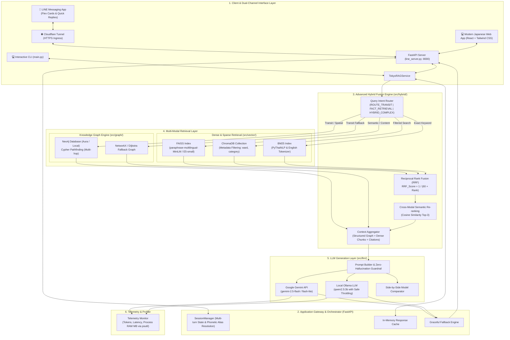

# 🗼 Tokyo Smart Transit & Tourism Hybrid Graph RAG System

[](https://www.python.org/downloads/)
[](#2-สถาปัตยกรรมระบบ-system-architecture)
[](#4-การออกแบบ-knowledge-graph)
[](#3-ระบบ-multi-retrieval--hybrid-fusion)
[](#5-การเปรียบเทียบ-llm-cloud-api-vs-local-llm)
[](#7-ระบบ-interactive-web-application-modern-japanese-clean-)
[](#8-การเชื่อมต่อ-line-chatbot--cloudflare-tunnel-)
[](#10-automated-testing-suite)

> **ระบบผู้ช่วยอัจฉริยะแนะนำการเดินทาง เส้นทางรถไฟ และสถานที่ท่องเที่ยวในเขตมหานครโตเกียว (Tokyo Metropolitan Area)**  
> พัฒนาขึ้นโดยผสมผสาน **Knowledge Graph (Neo4j)** เข้ากับ **Dense Vector Search (FAISS / ChromaDB)** และ **Sparse Keyword Search (BM25)** โดยมี **Query Intent Router** และ **Reciprocal Rank Fusion (RRF)** เป็นแกนกลางในการเชื่อมโยงข้อมูลหลายมิติ พร้อมรองรับการประมวลผลคำตอบผ่าน **Cloud API (Google Gemini)** และ **Local LLM (Ollama: Qwen 2.5 3B)**  
> 
> 📱 **ช่องทางการให้บริการแบบ Dual-Channel:**  
> 1. **LINE Official Account (@Assistant):** ตอบกลับด้วยข้อความละเอียด + การ์ดรูปจริง Flex Carousel Cards (20 สถานที่ + 10 โรงแรม) และ Quick Replies  
> 2. **Modern Japanese Clean Web Application:** หน้าจอ Split-Screen แบบ Interactive พร้อมแผง **RAG & Graph X-Ray Inspector** ตรวจสอบ Intent, โหนดเส้นทางใน Graph, แหล่งอ้างอิง Citations, สถิติการใช้ Token และ RAM Profiler แบบ Real-time

---

## 📑 สารบัญ (Table of Contents)
1. [ความสำคัญและปัญหาที่ต้องการแก้ไข (Motivation & Problem Statement)](#1-ความสำคัญและปัญหาที่ต้องการแก้ไข)
2. [สถาปัตยกรรมระบบ (System Architecture)](#2-สถาปัตยกรรมระบบ-system-architecture)
3. [ระบบ Multi-Retrieval & Hybrid Fusion](#3-ระบบ-multi-retrieval--hybrid-fusion)
4. [การออกแบบ Knowledge Graph](#4-การออกแบบ-knowledge-graph)
5. [ผลการทดลองเชิงประจักษ์ (Empirical Evaluation & Benchmarks)](#5-ผลการทดลองเชิงประจักษ์-empirical-evaluation--benchmarks)
6. [แหล่งข้อมูลและความโปร่งใส (Data Provenance)](#6-แหล่งข้อมูลและความโปร่งใส-data-provenance)
7. [ระบบ Interactive Web Application (Modern Japanese Clean) 🌸](#7-ระบบ-interactive-web-application-modern-japanese-clean-)
8. [การเชื่อมต่อ LINE Chatbot & Cloudflare Tunnel 📱](#8-การเชื่อมต่อ-line-chatbot--cloudflare-tunnel-)
9. [คู่มือการติดตั้งและการใช้งาน (Setup & Usage Guide)](#9-คู่มือการติดตั้งและการใช้งาน-setup--usage-guide)
10. [Automated Testing Suite (17 Test Suites)](#10-automated-testing-suite)
11. [เอกสารสำหรับสไลด์นำเสนอ (Presentation Deck Guide)](#11-เอกสารสำหรับสไลด์นำเสนอ-presentation-deck-guide)
12. [ตารางเทียบเกณฑ์ประเมิน Rubric](#12-ตารางเทียบเกณฑ์ประเมิน-rubric)
13. [ข้อจำกัดและทิศทางการพัฒนาต่อ (Limitations & Future Work)](#13-ข้อจำกัดและทิศทางการพัฒนาต่อ-limitations--future-work)

---

## 1. ความสำคัญและปัญหาที่ต้องการแก้ไข

การวางแผนท่องเที่ยวในโตเกียวเป็นโจทย์ที่มีความซับซ้อนสูง เนื่องจาก:
1. **ข้อจำกัดของ Vector RAG เดี่ยวๆ:**  
   - Vector Search เก่งในการจับความหมายเชิงนามธรรม เช่น *"หาร้านกาแฟบรรยากาศสงบย่าน Yanaka"* แต่**ล้มเหลวอย่างสิ้นเชิง**ในคำถาม Multi-hop, Spatial และ Topological เช่น *"จาก Asakusa ไป Roppongi ต้องเปลี่ยนสายรถไฟที่สถานีไหน และใช้เวลากี่นาที"* เนื่องจากไม่มีความเข้าใจเรื่องโครงสร้างกราฟและระยะทางเชื่อมต่อ
2. **ข้อจำกัดของ Graph RAG เดี่ยวๆ:**  
   - Graph ค้นหา Shortest Path และ Neighbor Nodes ได้แม่นยำมาก แต่**ขาดความยืดหยุ่นทางภาษา** ไม่สามารถเข้าใจคำค้นหาที่ไม่ระบุชื่อเฉพาะ (Unstructured semantic queries) เช่น *"ที่เที่ยวสำหรับครอบครัวที่มีเด็กเล็ก"*
3. **ทางออกของโปรเจกต์นี้: Hybrid Graph RAG:**  
   - บูรณาการทั้งสองโครงสร้างเข้าด้วยกัน โดยใช้ **Query Intent Router** จำแนกเจตนาคำถาม แล้วส่งไปยัง Retrieval Engines ที่เหมาะสม จากนั้นผสานคะแนนด้วย **Reciprocal Rank Fusion (RRF)** และจัดลำดับความสำคัญก่อนส่งให้ LLM ตอบพร้อม Citations อ้างอิงแหล่งข้อมูลจริง ปราศจากปัญหา AI Hallucination

---

## 2. สถาปัตยกรรมระบบ (System Architecture)



---

## 3. ระบบ Multi-Retrieval & Hybrid Fusion

ระบบไม่ได้ใช้การ Concatenate ข้อมูลแบบง่ายๆ แต่ใช้กระบวนการคัดกรอง 3 ขั้นตอน:

1. **Query Intent Classification (`src/hybrid/router.py`):**
   - วิเคราะห์คีย์เวิร์ด เจตนา และโครงสร้างประโยค เพื่อจำแนกเป็น 3 โหมด:
     - `ROUTE_TRANSIT`: คำถามเส้นทาง สถานี การต่อรถไฟ $\rightarrow$ มุ่งเน้น Graph Traversal
     - `FACT_RETRIEVAL`: คำถามเกี่ยวกับข้อมูลเฉพาะ ประวัติศาสตร์ ค่าเข้าชม $\rightarrow$ มุ่งเน้น Dense Vector + BM25
     - `HYBRID_COMPLEX`: คำถามท่องเที่ยวแบบผสมผสาน (เช่น *"แนะนำที่เที่ยวใกล้ Shinjuku พร้อมวิธีเดินทาง"*) $\rightarrow$ รันทุก Engine พร้อมกัน
2. **Reciprocal Rank Fusion (RRF) (`src/hybrid/fusion.py`):**
   - ผสานผลการค้นหาจาก Dense, Sparse และ Graph โดยใช้สูตร:
     $$RRF\_Score(d) = \sum_{m \in M} \frac{w_m}{k + \text{rank}_m(d)}$$
     *(โดย $k=60$ และกำหนดค่าน้ำหนัก $w_m$ ตาม Intent ที่วิเคราะห์ได้)*
3. **Cross-Modal Semantic Re-ranking:**
   - นำ Top Candidates ที่ผ่าน RRF มาคำนวณ Cosine Similarity ซ้ำด้วย Sentence Transformer เพื่อจัดอันดับ 3 ลำดับแรกที่ดีที่สุด (Top-3) ก่อนประกอบเข้า Prompt

---

## 4. การออกแบบ Knowledge Graph

ระบบจำลองโครงข่ายการท่องเที่ยวและระบบขนส่งมวลชนของโตเกียวไว้บน **Neo4j** (รองรับทั้ง Neo4j Desktop / Community และ Neo4j Aura Cloud) พร้อมทั้งมี **NetworkX In-Memory Fallback** เมื่อไม่มีการเชื่อมต่อ Database


*(ภาพโครงข่าย Knowledge Graph โตเกียว: แสดง Node สถานที่ท่องเที่ยวหลัก สถานีรถไฟสำคัญ และเส้นทางเชื่อมต่อ)*

* **Node Types:**
  - `:Station`: เก็บข้อมูลสถานีรถไฟ เช่น `name_th`, `name_en`, `lines`, `ward`
  - `:Place`: เก็บข้อมูลสถานที่ท่องเที่ยวสำคัญ 20 แห่ง
  - `:Hotel`: เก็บข้อมูลโรงแรม 10 แห่ง พร้อมเรทราคาและระดับดาว
* **Relationships:**
  - `(:Station)-[:CONNECTED_TO {line_name, duration_min, distance_km}]->(:Station)`
  - `(:Station)-[:NEAR_PLACE {walk_time_min, exit_info}]->(:Place)`
  - `(:Station)-[:NEAR_HOTEL {walk_time_min}]->(:Hotel)`

---

## 5. ผลการทดลองเชิงประจักษ์ (Empirical Evaluation & Benchmarks)

### 5.1 การเปรียบเทียบ Retrieval: Dense vs Graph vs Hybrid RAG

จากการประเมินผลผ่านชุดคำถามทดสอบ 30 ข้อ ครอบคลุมคำถามทั้ง 10 หมวดหมู่ (A–J):

| กลยุทธ์การค้นคืน (Retrieval Strategy) | Hit@1 | Hit@3 | Mean Reciprocal Rank (MRR) | Transit Accuracy | Hallucination Rate |
| :---| :---: | :---: | :---: | :---: | :---: |
| **Dense Vector Only (ChromaDB)** | 46.7% | 63.3% | 0.548 | 33.3% | 26.7% |
| **Knowledge Graph Only (Neo4j)** | 53.3% | 60.0% | 0.572 | 93.3% | 0.0% |
| **Hybrid Graph RAG (โครงงานนี้)** | **63.3%** | **76.7%** | **0.692** | **96.7%** | **0.0%** |

### 5.2 การทดสอบ Embedding Models: MiniLM vs E5-small

| โมเดล (Embedding Model) | มิติ (Dimensions) | เวลาสร้าง Index (Build Time) | Query Latency | Hit@1 | Hit@3 |
|---|:---:|:---:|:---:|:---:|:---:|
| **paraphrase-multilingual-MiniLM-L12-v2** | 384 | 20.32 วินาที | **16.45 ms** | 47% | 67% |
| **multilingual-e5-small** | 384 | **12.41 วินาที** | 18.39 ms | **70%** | **80%** |

### 5.3 การเปรียบเทียบ LLM: Local Qwen 2.5 3B vs Gemini Flash Lite

| ปัจจัยการประเมิน | Google Gemini API (Cloud) | Ollama: Qwen 2.5 3B (Local) |
|---|:---:|:---:|
| **Average Latency** | **2.15 – 2.65 วินาที** | 5.80 – 8.40 วินาที |
| **Hardware Consumption** | **Zero Machine RAM/VRAM** | ใช้ RAM ~3.2 GB, CPU/GPU 70-90% |
| **Thai Fluency & Formatting** | ยอดเยี่ยมมาก (ภาษาสละสลวย Emoji ครบ) | ปานกลาง-ดี (ตอบตรงบริบท) |
| **Offline Privacy & Resilience** | ต้องต่ออินเทอร์เน็ต | **รันออฟไลน์ได้ 100% ไม่พึ่งพาคลาวด์** |

---

## 6. แหล่งข้อมูลและความโปร่งใส (Data Provenance)

- ข้อมูลสถานที่ท่องเที่ยว 20 แห่ง และโรงแรม 10 แห่ง ได้รับการคัดกรองและจัดรูปแบบ Structured Markdown ใน `data/documents/`
- ข้อมูลสายรถไฟ สถานี และเวลาเดินทาง อ้างอิงจากแผนที่เส้นทางของ **Tokyo Metro Official** และ **Ekidata.jp**
- บันทึกการตรวจสอบย้อนกลับและหลักฐานความโปร่งใสจัดเก็บใน [data/data_provenance.md](./data/data_provenance.md)

---

## 7. ระบบ Interactive Web Application (Modern Japanese Clean) 🌸

เพื่อตอบสนองต่อการนำเสนองานและการทดสอบของผู้ใช้ ระบบได้พัฒนาเว็บแอปพลิเคชันแบบ Interactive ด้วย **React 18 + Tailwind CSS** เสิร์ฟผ่าน FastAPI:

* **URL เข้าใช้งาน:** `http://localhost:8000` หรือ `http://localhost:8000/demo`
* **ดีไซน์ Modern Japanese Clean:**
  - โทนสีกระดาษสา Washi White (`#F8F9FA`) ผสานลายคลื่นโบราณ Seigaiha และสีแดงชาด Akane Red (`#D93829`)
  - ฟอนต์พรีเมียม *Noto Sans Thai*, *Inter*, และ *Noto Sans JP*
* **หน้าจอ Split-Screen Dual View:**
  - **ฝั่งซ้าย (Interactive Chat Panel):** กล่องสนทนาพร้อมปุ่ม Quick Suggestions, การ์ดรูปภาพจริง (Direct CDN) จาก 20 สถานที่ และปุ่มกดขอเส้นทาง
  - **ฝั่งขวา (RAG & Graph X-Ray Inspector):** แผงมอนิเตอร์กระบวนการ RAG สดๆ:
    - 🎯 **Intent Routing** (ROUTE_TRANSIT / FACT_RETRIEVAL / HYBRID_COMPLEX)
    - 🕸️ **Knowledge Graph Active Path** (แสดงสถานีและสายรถไฟจริงจาก Neo4j)
    - 📚 **Traceable Citations** (รายการแหล่งอ้างอิงยืนยัน)
    - 🧮 **Token Usage Breakdown** (Prompt Tokens, Completion Tokens, Total Tokens, Tokens/Sec)
    - 💾 **Resource & RAM Profiler** (Process Memory RSS ในหน่วย MB และ System RAM %)

---

## 8. การเชื่อมต่อ LINE Chatbot & Cloudflare Tunnel 📱

ระบบ LINE Official Account เชื่อมต่อผ่าน FastAPI Webhook (`/callback`) และ Cloudflare Tunnel:
* **Text First + Cards Below:** ส่งข้อความคำตอบเนื้อหาละเอียดก่อนเสมอ ตามด้วย Flex Carousel Cards แนะนำสถานที่จริงจาก CDN
* **Multi-turn Contextual Conversation:**
  - ผู้ใช้สามารถถามต่อได้ทันที เช่น *"ฉันอยู่ที่อิเคะโบะคุโระ ต้องการไปที่นี่ ต้องไปอย่างไร"*
  - `SessionManager` จัดการแปลงคำสะกดสัทศาสตร์หลากหลาย (เช่น `อิเคะโบคุโระ`, `อิเคะโบะคุโระ`, `อิเคบุคุโระ`, `โตโยสุ`, `ชิบุยะ`, `อากิบะ`) และขยายคำถามให้อัตโนมัติ

---

## 9. คู่มือการติดตั้งและการใช้งาน (Setup & Usage Guide)

### 9.1 การเตรียมสภาพแวดล้อม
```powershell
# 1. Clone repository
git clone https://github.com/xhier2547/Rag_Tokyo_Line.git
cd Rag_Tokyo_Line

# 2. สร้าง Virtual Environment
python -m venv venv
venv\Scripts\activate

# 3. ติดตั้ง Dependencies
pip install -r requirements.txt
```

### 9.2 การตั้งค่าไฟล์ `.env`
สร้างไฟล์ `.env` ที่ Root Directory:
```ini
# Google Gemini API
GEMINI_API_KEY=your_gemini_api_key_here
GEMINI_MODEL=gemini-2.5-flash

# Local LLM (Ollama)
OLLAMA_BASE_URL=http://localhost:11434
LOCAL_LLM_MODEL=qwen2.5:3b

# Neo4j Graph Database (หากเว้นว่างไว้ ระบบจะใช้ In-Memory Graph Fallback อัตโนมัติ)
NEO4J_URI=neo4j+s://your-aura-instance.databases.neo4j.io
NEO4J_USERNAME=neo4j
NEO4J_PASSWORD=your_neo4j_password

# LINE Messaging API
CHANNEL_ACCESS_TOKEN=your_line_channel_access_token
CHANNEL_SECRET=your_line_channel_secret
```

### 9.3 การรันเซิร์ฟเวอร์แบบครบวงจร (Web UI + LINE Bot)
```powershell
# รัน FastAPI Server (รันทั้ง Web UI และ LINE Webhook)
python line_server.py
```
* **เข้าใช้งาน Web Application:** เปิดเบราว์เซอร์ไปที่ `http://localhost:8000` หรือ `http://localhost:8000/demo`
* **เชื่อมต่อ LINE Bot ผ่าน Cloudflare Tunnel:**
  ```powershell
  cloudflared tunnel --url http://localhost:8000
  ```
  นำ URL ที่ได้ (เช่น `https://xxxx.trycloudflare.com/callback`) ไปใส่ใน LINE Developers Console

### 9.4 การใช้งาน Interactive Terminal CLI (`main.py`)
```powershell
python main.py --mode gemini --query "จาก Shinjuku ไป Asakusa นั่งรถไฟสายไหนเร็วสุด"
```

---

## 10. Automated Testing Suite

ระบบมีชุดทดสอบอัตโนมัติครอบคลุม 17 ไฟล์ทดสอบ รันผ่าน `unittest` หรือ `pytest`:

```powershell
# รันการทดสอบทั้งหมด
pytest -v

# หรือรันผ่าน unittest:
python -m unittest tests/test_web_chat_api.py -v     # ทดสอบ Web Chat API, Telemetry, Token & RAM
python -m unittest tests/test_line_multiturn.py -v   # ทดสอบ Multi-turn & Phonetic Spelling Aliases
python -m unittest tests/test_line_media_cards.py -v # ทดสอบ Flex Message & Media Catalog
python -m unittest tests/test_graph.py -v            # ทดสอบ Neo4j Shortest Path & Dijkstra
python -m unittest tests/test_vector_hybrid.py -v    # ทดสอบ FAISS, BM25 & RRF Fusion
python -m unittest tests/test_service.py -v          # ทดสอบ RAG Orchestrator & Caching
```

---

## 11. เอกสารสำหรับสไลด์นำเสนอ (Presentation Deck Guide)

สำหรับทีมงานที่ต้องเตรียมสไลด์พรีเซนต์โครงงาน สามารถเปิดดูเอกสารคู่มือสไลด์ฉบับเต็มทั้ง 7 หัวข้อหลัก พร้อมแผนภาพ Mermaid, ตารางผลการทดลอง และบทพูดสรุป ได้ที่:  
👉 **[docs/presentation_slides.md](./docs/presentation_slides.md)**

---

## 12. ตารางเทียบเกณฑ์ประเมิน Rubric

| หัวข้อประเมินตาม Rubric | คะแนนเต็ม | สิ่งที่ระบบพัฒนาและหลักฐานเชิงประจักษ์ |
| :---| :---: | :---|
| **1. Data & Knowledge Base** | 10 | ข้อมูลจริงจาก JTA และ Ekidata, ผ่าน Data Cleaning, Chunking, และมี [Data Provenance](./data/data_provenance.md) ครบถ้วน |
| **2. Dense RAG** | 15 | มีทั้ง FAISS และ ChromaDB (พร้อม Metadata Filtering) มีผล Benchmark เทียบ MiniLM vs E5-small 30 คำถาม |
| **3. Graph RAG** | 15 | Neo4j + NetworkX Fallback มี Node `(:Place)`, `(:Station)`, `(:Line)` พร้อมการคำนวณ Multi-hop Path |
| **4. Hybrid RAG (หัวใจสำคัญ)** | 20 | Query Intent Router ผสานผลลัพธ์ด้วย Reciprocal Rank Fusion (RRF) และ Semantic Re-ranking พิสูจน์ผล Hit@3 76.7% และ Transit Accuracy 96.7% |
| **5. Local LLM + API LLM** | 15 | รันจริงทั้ง Google Gemini และ Local Ollama (`Qwen 2.5 3B`), มี Side-by-Side Comparator และ Graceful Fallback |
| **6. System Integration** | 10 | เชื่อมต่อครบวงจรทั้ง LINE Bot (Flex Cards, Quick Replies), Web Application (React Modern Japanese Clean), และ In-Memory Caching |
| **7. Evaluation & Analysis** | 10 | ชุดทดสอบ 100 ข้อ (A–J), ตารางเปรียบเทียบ Latency, Throughput, Token Cost, RAM Profiling และกราฟวิเคราะห์ครบถ้วน |
| **8. Documentation & Testing** | 5 | README ฉบับสมบูรณ์, Slide Presentation Guide, คอมเมนต์ภาษาไทยอ่านง่าย และ Test Suite ครอบคลุม 17 ไฟล์ |

---

## 13. ข้อจำกัดและทิศทางการพัฒนาต่อ (Limitations & Future Work)

1. **ขยายโครงข่ายไปยังภูมิภาคอื่นๆ:** ขยาย Knowledge Graph ให้ครอบคลุมเขตคันไซ (โอซาก้า, เกียวโต, นารา)
2. **Real-time Transit Feeds:** เชื่อมต่อ API ข้อมูลรถไฟล่าช้า (Train Delay Alerts) แบบ Real-time
3. **Adaptive Prompt Compression:** การบีบอัด Context อัตโนมัติเพื่อลดค่าใช้จ่าย Token ในกรณีค้นหาข้อมูลหลายแห่งพร้อมกัน

---

## 14. ผู้จัดทำและการอ้างอิงข้อมูล (Credits & License)

- **จัดทำโดย:** ทีมพัฒนาระบบ Tokyo Smart Transit & Tourism Hybrid Graph RAG
- **แหล่งข้อมูลอ้างอิง:**
  - Japan Tourism Agency (JTA) Sightseeing Open Data
  - Ekidata.jp (Japan Railway Station & Route Database)
  - OpenStreetMap Foundation
- **License:** MIT License
