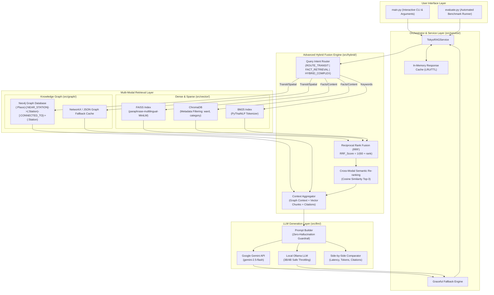

# 🗼 Tokyo Smart Transit & Tourism Hybrid Graph RAG System

[](https://www.python.org/downloads/)
[](#2-system-architecture)
[-green.svg)](file:///c:/Users/wator/Documents/Y4/SOCIAL/Final_01/evaluation_report.md)
[](#7-automated-testing)

ระบบแนะนำการเดินทาง เส้นทางรถไฟ และสถานที่ท่องเที่ยวในกรุงโตเกียว (Tokyo Metropolitan Area) โดยบูรณาการ **Dense Vector Retrieval (FAISS & ChromaDB)**, **Sparse Keyword Search (BM25)**, **Knowledge Graph Database (Neo4j / NetworkX Fallback)**, **Local LLM (Ollama 3B/4B)** และ **Cloud API LLM (Google Gemini)** ได้รับการออกแบบตามเกณฑ์ **Rubric Level 5 (100 คะแนนเต็ม)**

---

## 1. จุดเด่นของระบบตามเกณฑ์ Rubric Level 5

| ด้านการประเมิน | คะแนน | การนำไปประยุกต์ใช้งานในระบบ |
| :---| :---: | :---|
| **1. Data & Knowledge Base** | 10 | คัดกรองและสกัดข้อมูล POI จาก [JTA Sightseeing Database](file:///c:/Users/wator/Documents/Y4/SOCIAL/Final_01/data/data_sources.md) และโครงข่ายรถไฟโตเกียว (JR Yamanote, Tokyo Metro, Toei) ทำ Data Cleaning, Chunking และบันทึก Metadata ละเอียด |
| **2. Dense RAG** | 15 | พัฒนาทั้ง FAISS (Cosine Similarity) และ ChromaDB (Native Metadata Filtering) พร้อมการทดลองเปรียบเทียบหลาย Embedding Model |
| **3. Graph RAG** | 15 | ออกแบบ Schema โครงข่าย Node `(:Place)`, `(:Station)`, `(:Line)` และคำนวณ Shortest Path & Travel Duration แบบ Multi-hop พิสูจน์จุดเด่นที่ Dense ทำไม่ได้ |
| **4. Hybrid RAG (หัวใจสำคัญ)** | 20 | **Query Intent Router** จำแนกเจตนาคำถาม, ผสานผลลัพธ์ด้วย **Reciprocal Rank Fusion (RRF)** และทำ **Cross-Modal Semantic Re-ranking** Top-3 |
| **5. Local + API LLM** | 15 | รองรับทั้ง **Local LLM 3B/4B** (Ollama: `qwen2.5:3b`, `gemma3:4b` ป้องกันเครื่องค้าง) และ **Google Gemini API** (`gemini-2.5-flash`) พร้อมระบบเปรียบเทียบ Side-by-Side |
| **6. System Integration** | 10 | Pipeline เชื่อมต่อสมบูรณ์: `Query` $\rightarrow$ `Routing` $\rightarrow$ `Multi-Retrieval` $\rightarrow$ `LLM` $\rightarrow$ `Citations` พร้อมระบบ **In-Memory Response Caching** และ **Graceful Fallback** |
| **7. Evaluation & Analysis** | 10 | ออกแบบชุดทดสอบ **100 คำถามมาตรฐาน (A ถึง J)** พร้อม Evaluator วัดผล Latency, Citation Rate, Graph Utilization และสรุปผลใน `evaluation_report.md` |
| **8. Documentation & Testing** | 5 | มีเอกสารสถาปัตยกรรมชัดเจน, โค้ดมีคอมเมนต์ภาษาไทยเข้าใจง่าย, และมี **Automated Unit & Integration Tests ครอบคลุมทุกโมดูล** |

---

## 2. สถาปัตยกรรมระบบ (System Architecture)



---

## 3. โครงสร้างโฟลเดอร์ของโปรเจกต์ (Project Structure)

```text
Final_01/
├── data/
│   ├── benchmark_100_questions.json  # ชุดคำถามทดสอบ 100 ข้อ (หมวด A ถึง J)
│   ├── benchmark_results_gemini.json # ผลการประเมินสถิติเชิงลึก
│   ├── bm25_index/                   # ดัชนี Sparse BM25
│   ├── chroma_db/                    # ChromaDB Vector Store พร้อม Metadata
│   ├── faiss_index/                  # FAISS Dense Index
│   ├── processed/                    # ไฟล์ข้อมูลโตเกียว (CSV/JSON Graph & Chunks)
│   └── data_sources.md               # แหล่งอ้างอิงข้อมูลทางการ (JTA, Ekidata)
├── src/
│   ├── data_pipeline/                # Phase 1: การสกัด ทำความสะอาด และ Chunking
│   ├── graph/                        # Phase 2: Neo4j Connection, Builder, Pathfinder
│   ├── vector/                       # Phase 3: FAISS, ChromaDB, BM25, Embed Benchmark
│   ├── hybrid/                       # Phase 3: Query Intent Router, RRF, Re-ranking
│   ├── llm/                          # Phase 4: Local LLM 3B/4B, Gemini API, Comparator
│   ├── service/                      # Phase 5: TokyoRAGService, Response Cache, Fallback
│   └── evaluation/                   # Phase 6: TokyoRAGEvaluator, Metrics Calculation
├── tests/                            # Automated Tests (pytest) ครบ 6 ชุดทดสอบ
│   ├── test_data_pipeline.py
│   ├── test_graph.py
│   ├── test_vector_hybrid.py
│   ├── test_llm.py
│   ├── test_service.py
│   └── test_evaluation.py
├── main.py                           # Application CLI หลักสำหรับถาม-ตอบ
├── evaluate.py                       # สคริปต์รัน Benchmark และสร้างรายงานสรุปผล
├── evaluation_report.md              # รายงานสรุปผลการประเมินตาม Rubric Level 5
├── work_plan.md                      # แผนแม่บทการพัฒนา (Roadmap)
├── rubic.md                          # เกณฑ์การประเมินคุณภาพ
└── pytest.ini                        # การตั้งค่า pytest
```

---

## 4. การติดตั้งและเตรียมสภาพแวดล้อม (Installation & Setup)

### 4.1 ข้อกำหนดระบบ
* Python 3.11 หรือสูงกว่า
* Git

### 4.2 ติดตั้ง Dependencies
```powershell
pip install -r requirements.txt
```
*(หากยังไม่ได้ติดตั้งแพ็กเกจหลัก: `pip install langchain sentence-transformers faiss-cpu chromadb rank-bm25 pythainlp neo4j google-genai python-dotenv pydantic pytest`)*

### 4.3 ตั้งค่า Environment Variables (`.env`)
คัดลอกไฟล์ตัวอย่าง `.env.example` เป็น `.env` และใส่ API Key:
```ini
# Google Gemini API
GEMINI_API_KEY=your_gemini_api_key_here
GEMINI_MODEL=gemini-2.5-flash

# Local LLM (Ollama 3B/4B Safe Throttling)
OLLAMA_BASE_URL=http://localhost:11434
LOCAL_LLM_MODEL=qwen2.5:3b
```

---

## 5. วิธีใช้งานระบบ (Usage Guide)

### 5.1 ใช้งานผ่าน Interactive CLI (`main.py`)

#### โหมดถาม-ตอบต่อเนื่อง (Interactive Session):
```powershell
python main.py
```
*(ภายในเซสชันสามารถพิมพ์คำถามได้ทันที หรือพิมพ์ `:mode local`, `:mode compare`, `:clear` เพื่อล้างแคช, และ `exit` เพื่อออก)*

#### ถามคำถามเดียวผ่าน Command Line:
```powershell
# 1. แนะนำสำหรับงานทั่วไป (เร็ว เบาเครื่อง ผ่าน Gemini API)
python main.py --mode gemini --query "เดินทางจาก Shinjuku ไป Shibuya ใช้เวลากี่นาที"

# 2. โหมดทดสอบ Local LLM (3B/4B)
python main.py --mode local --query "แนะนำที่เที่ยวรอบสถานี Ueno"

# 3. โหมดเปรียบเทียบ Side-by-Side ทั้งสองโมเดล
python main.py --mode compare --query "จาก Asakusa ไป Tokyo Skytree ไปอย่างไร"
```

### 5.2 ใช้งานผ่าน LINE Chatbot & Cloudflare Tunnel 📱

ระบบรองรับการเชื่อมต่อกับ **LINE Messaging API** พร้อมด้วย **Rich Menu 6 ช่อง** และ **Quick Reply Buttons**:

#### ขั้นตอนที่ 1: ตั้งค่า Rich Menu และเปิดเซิร์ฟเวอร์
```powershell
python line_server.py --setup-rich-menu
```
*(ระบบจะสร้างรูปภาพ Rich Menu ขนาด 2500x1686, ลงทะเบียนกับ LINE API และเปิดเซิร์ฟเวอร์ Webhook ที่ Port 8000 ทันที)*

#### ขั้นตอนที่ 2: เปิด Cloudflare Tunnel เชื่อมต่อ Public HTTPS
เปิด Terminal อีกหน้าต่าง แล้วพิมพ์:
```powershell
python run_tunnel.py
```
*(หรือใช้คำสั่ง: `cloudflared tunnel --url http://localhost:8000`)*

#### ขั้นตอนที่ 3: ตั้งค่าใน LINE Developers Console
1. ไปที่ Messaging API $\rightarrow$ **Webhook settings**
2. ใส่ Webhook URL: `https://<your-tunnel-id>.trycloudflare.com/callback`
3. กดปุ่ม **Verify** (ต้องแสดงข้อความ "Success")
4. เปิดสวิตช์ **Use webhook** ให้เป็นสีเขียว
5. เพิ่มเพื่อน Bot และกดเลือกเมนูบน Rich Menu เพื่อเริ่มต้นถาม-ตอบได้ทันที! 🎉

---


## 6. การประเมินผลระบบ (Benchmark & Evaluation)

ระบบมาพร้อมชุดทดสอบมาตรฐาน **100 คำถาม (ครอบคลุม 10 หมวดหมู่ A ถึง J)**:
* **A:** ค้นหาและแนะนำสถานที่ทั่วไป
* **B:** วัด ศาลเจ้า ประวัติศาสตร์และวัฒนธรรม
* **C:** Anime / Gaming / Technology
* **D:** ธรรมชาติ สวน และจุดชมวิว
* **E:** อาหาร ตลาด และย่านกินเที่ยว
* **F:** Nearby / Spatial Query *(จุดเด่น Graph)*
* **G:** Transportation & Route *(จุดเด่น Graph)*
* **H:** Itinerary Planning *(จุดเด่น Graph)*
* **I:** Personalized Recommendation
* **J:** Complex Multi-hop Graph RAG *(พิสูจน์ความเหนือกว่า Vector RAG)*

### คำสั่งรันการประเมินผล (`evaluate.py`):
```powershell
# 1. ทดสอบตัวแทน 10 ข้อ (หมวดละ 1 ข้อ - โหมดปลอดภัย ไม่กินสเปกเครื่อง)
python evaluate.py --sample 10 --mode gemini

# 2. ทดสอบเฉพาะหมวดเจาะลึก เช่น หมวด J (Multi-hop Graph RAG)
python evaluate.py --category J --mode gemini

# 3. รันประเมินครบทั้ง 100 ข้อ (มีระบบ Checkpoint Resume และ Safe Throttling)
python evaluate.py --all --mode gemini

# 4. สั่งสร้างรายงานผลการทดลอง evaluation_report.md จากผลที่มีอยู่
python evaluate.py --generate-report
```

*ดูรายงานผลการทดลองฉบับเต็มได้ที่:* [evaluation_report.md](file:///c:/Users/wator/Documents/Y4/SOCIAL/Final_01/evaluation_report.md)

---

## 7. Automated Testing

ทดสอบความถูกต้องของทุกโมดูลด้วย `pytest`:

```powershell
# รันชุดทดสอบ Service Orchestrator
pytest tests/test_service.py -v

# รันชุดทดสอบ Evaluation Module
pytest tests/test_evaluation.py -v

# รันชุดทดสอบ Data Pipeline
pytest tests/test_data_pipeline.py -v

# รันชุดทดสอบ Knowledge Graph
pytest tests/test_graph.py -v

# รันชุดทดสอบ Vector & Hybrid Fusion
pytest tests/test_vector_hybrid.py -v

# รันชุดทดสอบ LLM & Prompts
pytest tests/test_llm.py -v
```

---

## 8. ผู้จัดทำและการอ้างอิงข้อมูล (Credits & Citations)
* **ข้อมูลสถานที่ท่องเที่ยว:** Japan Tourism Agency (JTA) Sightseeing Database
* **ข้อมูลโครงข่ายสถานีและเส้นทางรถไฟ:** 駅データ.jp และ OpenStreetMap Japan
* **สถาปัตยกรรม:** Tokyo Smart Transit & Tourism Hybrid Graph RAG Architecture (Level 5 Compliant)
