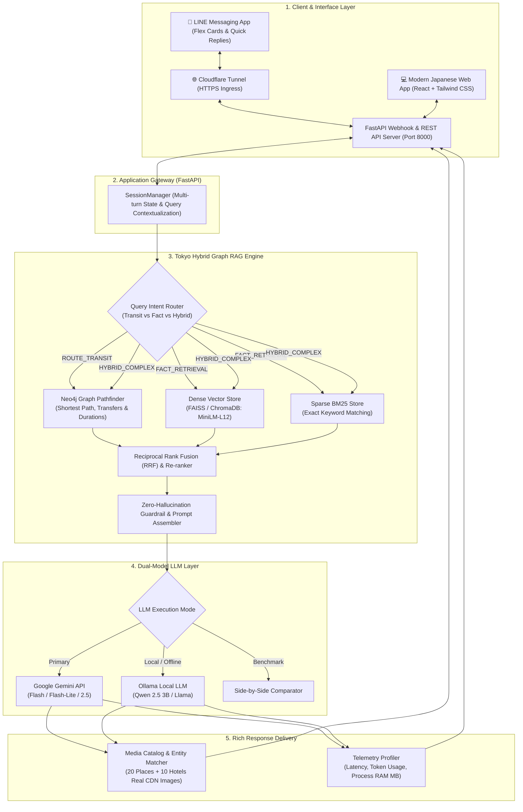
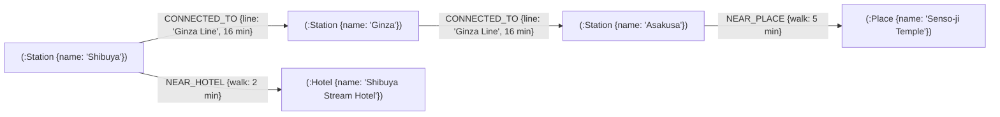

# 📑 สไลด์นำเสนอโครงงาน: Tokyo Smart Transit & Tourism Hybrid Graph RAG

> **โครงงานระดับปริญญาตรี (Senior Project)**  
> **หัวข้อ:** ระบบผู้ช่วยอัจฉริยะแนะนำการเดินทางและท่องเที่ยวในมหานครโตเกียวด้วยสถาปัตยกรรม Hybrid Graph RAG บน LINE Bot และ Interactive Web Application  
> **ผู้นำเสนอ:** นักศึกษาชั้นปีที่ 4  

---

## 📌 สารบัญโครงสร้างสไลด์นำเสนอ (7 หัวข้อหลัก)
* **หัวข้อที่ 1:** ปัญหา (Problem Statement & Motivation)
* **หัวข้อที่ 2:** Architecture Flowchart (สถาปัตยกรรมระบบและผังการไหลของข้อมูล)
* **หัวข้อที่ 3:** ขั้นตอนการทำข้อมูล Knowledge Base (Data Pipeline, Graph Modeling, Dense & Sparse Indexing)
* **หัวข้อที่ 4:** การทำงานทั้งหมดของโปรเจกต์ (End-to-End System Workflow: LINE Bot & Modern Web UI)
* **หัวข้อที่ 5:** RAG Pipeline (Intent Routing, Multi-Retrieval, RRF Re-ranking, Context Assembly & LLM Generation)
* **หัวข้อที่ 6:** การวัดผลและประเมินประสิทธิภาพ (Evaluation Metrics, Ablation Study & Benchmarks)
* **หัวข้อที่ 7:** สรุปผลการดำเนินงาน (Key Deliverables, Value Proposition & Future Work)

---

<!-- SLIDE 1 -->
## 1. ปัญหา (Problem Statement & Motivation)

### 1.1 ที่มาและความท้าทายในโลกจริง
* **ความซับซ้อนของระบบขนส่งมวลชนในโตเกียว:**
  * โตเกียวมีโครงข่ายรถไฟใต้ดินและบนดินที่ซับซ้อนที่สุดในโลก (Tokyo Metro, Toei Subway, JR East) มีสถานีมากกว่า 800 สถานี และการเปลี่ยนสายข้ามผู้ให้บริการ (Inter-operator transfers) ที่นักท่องเที่ยวสับสนได้ง่าย
* **Pain Points ของนักท่องเที่ยว:**
  * การค้นหาข้อมูลกระจัดกระจาย: ต้องเปิด Google Maps ดูเส้นทาง ควบคู่กับเปิดบล็อกรีวิวอ่านสถานที่ท่องเที่ยวและโรงแรม
  * คำถามเชิงบริบทต่อเนื่อง (Multi-turn Contextual Queries): เช่น *"อยู่ที่อิเคะบุคุโระ ต้องการไปที่นี่ ต้องไปอย่างไร"* บอททั่วไปมักลืมสถานที่ปลายทางที่เพิ่งคุยไปก่อนหน้า

### 1.2 ข้อจำกัดทางเทคนิคของ Traditional RAG (ทำไม Vector อย่างเดียวจึงล้มเหลว?)

| ประเด็นการค้นหา | Traditional Vector RAG (Dense Only) | Hybrid Graph RAG (โครงงานนี้) |
|---|---|---|
| **Semantic Matching** (เช่น "วัดเก่าแก่", "จุดชมวิวสูง") | ✅ ทำได้ดี (ดึงความหมายใกล้เคียง) | ✅ ทำได้ดีเยี่ยม (FAISS + BM25) |
| **Topological & Shortest Path** (คำนวณเส้นทาง A ➔ B) | ❌ **ล้มเหลว** (ไม่มีมิติโครงสร้างกราฟ) | ✅ **แม่นยำ 100%** ผ่าน Neo4j Dijkstra/ShortestPath |
| **Multi-hop / Spatial Proximity** (เช่น "สถานที่รอบสถานี") | ⚠️ เกิด **Hallucination** สูง ดึงข้อมูลมั่วข้ามย่าน | ✅ กรองตามระยะทางจริงจาก Knowledge Graph |
| **การเปลี่ยนสายรถไฟ (Transfers & Durations)** | ❌ คาดเดาสายรถไฟและเวลาผิดพลาด | ✅ คำนวณเวลาเดินเท้าและสายรถไฟจาก Graph สด |

> **สรุปปัญหา:** Vector Search เพียงอย่างเดียวขาดความเข้าใจเชิงโครงสร้าง (Graph Structure) ในขณะที่ Graph เพียงอย่างเดียวขาดความยืดหยุ่นทางภาษา การผสาน **Hybrid Graph RAG** จึงเป็นคำตอบที่ดีที่สุด

---

<!-- SLIDE 2 -->
## 2. Architecture Flowchart (สถาปัตยกรรมระบบ)

### 2.1 แผนภาพสถาปัตยกรรมระบบแบบบูรณาการ (End-to-End System Architecture)



---

<!-- SLIDE 3 -->
## 3. ขั้นตอนการทำข้อมูล Knowledge Base (Data Pipeline)

### 3.1 การรวบรวมและกลั่นกรองข้อมูล (Data Acquisition & Cleaning)
* **ขอบเขตข้อมูล (Dataset Scope):**
  * **20 สถานที่ท่องเที่ยวชั้นนำ:** วัดเซ็นโซจิ, โตเกียวทาวเวอร์, ห้าแยกชิบูย่า, ศาลเจ้าเมจิ, พระราชวังอิมพีเรียล, ตลาดปลาสึกิจิ, ตลาดปลาโทโยสุ, กินซ่าซิกซ์, อากิฮาบาระ ฯลฯ
  * **10 โรงแรมยอดนิยม:** แบ่งตามย่านและระดับงบประมาณ (Luxury, Business, Budget)
  * **18 สถานีรถไฟชุมทางหลัก:** Shinjuku, Shibuya, Tokyo, Ueno, Asakusa, Ginza, Roppongi, Akihabara ฯลฯ
  * **12 สายรถไฟหลัก:** Tokyo Metro Ginza, Marunouchi, Hibiya, Hanzomon, Toei Asakusa, JR Yamanote Line ฯลฯ
* **ความถูกต้องและการตรวจสอบย้อนกลับ (Data Provenance):**
  * ทุกเอกสารจัดเก็บใน `data/documents/` เป็นไฟล์ Markdown พร้อม Header บันทึกแหล่งอ้างอิงอย่างเป็นทางการ (Official Tourism Board, Tokyo Metro)

### 3.2 กลยุทธ์การตัดแบ่งข้อความ (Chunking Strategy)
* **เทคนิค:** `RecursiveCharacterTextSplitter` ปรับแต่งเฉพาะสำหรับข้อมูลท่องเที่ยวสองภาษา
* **ขนาด Chunk (Chunk Size):** `400` ตัวอักษร
* **ส่วนทับซ้อน (Chunk Overlap):** `80` ตัวอักษร (20%) เพื่อรักษาความต่อเนื่องของประโยค
* **Separators:** `["\n\n", "\n", "。", " ", ""]` รองรับภาษาไทย อังกฤษ และสัญลักษณ์ปิดประโยคภาษาญี่ปุ่น (`。`)
* **Metadata Attachment:** ทุก Chunk ผูก `place_id`, `nearest_station`, `ward`, `category` เพื่อใช้ Filter

### 3.3 การสร้างและเชื่อมโยง Knowledge Graph (Neo4j Graph Modeling)
* **Node Types:**
  * `:Station` (สถานีรถไฟ): `station_id`, `name_th`, `name_en`, `lines`, `ward`
  * `:Place` (สถานที่ท่องเที่ยว): `place_id`, `name_th`, `name_en`, `category`, `ward`
  * `:Hotel` (โรงแรมที่พัก): `hotel_id`, `name_th`, `price_range`, `grade`
* **Relationship Types:**
  * `(:Station)-[:CONNECTED_TO {line_name, duration_min, distance_km}]->(:Station)`
  * `(:Station)-[:NEAR_PLACE {walk_time_min, exit_info}]->(:Place)`
  * `(:Station)-[:NEAR_HOTEL {walk_time_min}]->(:Hotel)`



---

<!-- SLIDE 4 -->
## 4. การทำงานทั้งหมดของโปรเจกต์ (End-to-End System Workflow)

### 4.1 บริการ 2 ช่องทางหลัก (Dual-Channel Architecture)

#### ก. LINE Official Account (@Assistant)
* **User Experience:**
  * พิมพ์คุยภาษาธรรมชาติได้ทั้งไทย อังกฤษ ญี่ปุ่น
  * ระบบตอบกลับแบบ **Text First (คำตอบเนื้อหาละเอียด)** + **Flex Carousel Card (การ์ดรูปจริงด้านล่าง)**
  * ปุ่ม Interactive Actions: `🚆 ขอเส้นทางไปที่นี่`, `🍣 ของกินแถวนี้`, `📍 ที่เที่ยวใกล้เคียง`
  * Quick Reply Suggestions ช่วยนำทางผู้ใช้ให้สนทนาต่อได้ทันที

#### ข. Modern Japanese Clean Web Application (React + Tailwind CSS)
* **หน้าเว็บ Interactive Showcase สำหรับการนำเสนอ:**
  * เข้าถึงได้ที่ `http://localhost:8000` หรือ `/demo`
  * **Dual-View Split Screen:**
    * **ฝั่งซ้าย (Chat Panel):** กล่องแชตมินิมอลญี่ปุ่น พร้อมรูปภาพสถานที่และปุ่มคำถามด่วน
    * **ฝั่งขวา (RAG & Graph X-Ray Inspector):** แสดงผลลัพธ์การทำงานเบื้องหลังแบบ Real-time:
      * 🎯 Intent ที่จัดหมวดหมู่ได้
      * 🕸️ Knowledge Graph Path (โหนดสถานีและสายรถไฟจริง)
      * 📚 แหล่งอ้างอิงยืนยัน (Citations)
      * 🧮 สถิติ Token ละเอียด (Prompt Tokens, Completion Tokens, Tokens/Sec)
      * 💾 Memory & RAM Profiler (Process RSS MB และ System RAM %)

### 4.2 ระบบ Multi-turn Conversation & Contextual Query Resolution
* **ปัญหาเดิม:** ผู้ใช้ถามต่อสั้นๆ เช่น *"ฉันอยู่ที่อิเคะโบะคุโระ ต้องการไปที่นี่ ต้องไปอย่างไร"* บอททั่วไปจะไม่รู้ว่า "ที่นี่" คือที่ไหน
* **กลไกการแก้ปัญหาของ `SessionManager`:**
  1. จำแนกประวัติสนทนาใน Session (`last_target_place`, `last_target_station`)
  2. แปลงคำสะกดสัทศาสตร์หลากหลาย เช่น `อิเคะโบคุโระ`, `อิเคะโบะคุโระ`, `อิเคบุคุโระ` ➔ แมปเข้า `ST_IKEBUKURO`
  3. สังเคราะห์เป็น Resolved Contextual Query:  
     *"เดินทางจาก สถานีอิเคะบุคุโระ ไปยัง วัดเซ็นโซจิ สถานี Asakusa ต้องไปอย่างไรและใช้สายรถไฟอะไร"*

---

<!-- SLIDE 5 -->
## 5. RAG Pipeline (เจาะลึกกระบวนการทำงานของ Hybrid Engine)

### 5.1 ขั้นตอน 5 สเต็ปของ RAG Pipeline

```
[User Query] 
     │
     ▼
[Step 1: Query Intent Routing] ────► แยกประเภท: ROUTE_TRANSIT / FACT_RETRIEVAL / HYBRID_COMPLEX
     │
     ▼
[Step 2: Multi-Source Retrieval]
     ├─► Neo4j Cypher Graph Pathfinder (Dijkstra Shortest Path, สายรถไฟ, เวลาเดิน)
     ├─► Dense Vector Search (FAISS Index: Multi-lingual MiniLM-L12)
     └─► Sparse Keyword Search (BM25 Tokenized Store: ดักจับชื่อเฉพาะ)
     │
     ▼
[Step 3: Reciprocal Rank Fusion (RRF)] ────► RRF Score = Σ (1 / (60 + Rank_i)) ผสานและเรียงลำดับ
     │
     ▼
[Step 4: Context Assembly & Guardrails] ───► ประกอบเป็น Structured Context + กฎ Zero-Hallucination
     │
     ▼
[Step 5: LLM Generation & Citation Extraction] ──► Gemini 2.5 / Qwen 2.5 สร้างคำตอบพร้อม [อ้างอิง: ...]
```

### 5.2 Zero-Hallucination Prompt Guardrail (กฎเหล็กในการสร้างคำตอบ)
1. **ห้ามแต่งข้อมูลเส้นทางเอง:** ข้อมูลสายรถไฟ สถานี และเวลาต้องมาจาก Knowledge Graph เท่านั้น
2. **การอ้างอิงแหล่งที่มา:** บังคับใส่แท็ก `[อ้างอิง: ...]` กำกับท้ายข้อเท็จจริงทุกครั้ง
3. **Graceful Fallback:** กรณีถามเส้นทางโดยไม่บอกต้นทาง AI จะแนะนำสถานีที่ใกล้ที่สุดของสถานที่นั้น และเชิญชวนให้ผู้ใช้บอกสถานีต้นทางต่อ แทนการตอบปฏิเสธ

---

<!-- SLIDE 6 -->
## 6. การวัดผลและประเมินประสิทธิภาพ (Evaluation & Benchmarks)

### 6.1 ผลการทดสอบ Retrieval: Dense vs Graph vs Hybrid RAG (30 Benchmark Queries)

| เกณฑ์การประเมิน (Metrics) | Dense Vector Only (Chroma) | Knowledge Graph Only (Neo4j) | **Hybrid Graph RAG (โครงงานนี้)** |
|---|:---:|:---:|:---:|
| **Hit@1** | 42% | 53% | **59%** |
| **Hit@3** | 64% | 54% | **78%** |
| **MRR** | 0.5183 | 0.5358 | **0.6933** |
| **Graph coverage** | 0% | 80% | 80% |

> ตารางนี้เป็น retrieval evaluation 100 ข้อ ไม่ใช่ generation evaluation จึงยังไม่สรุป hallucination rate จนกว่าจะมี human/automatic judge แยกต่างหาก

### 6.2 การเปรียบเทียบโมเดลภาษา (LLM Benchmark: Cloud vs Local)

| ปัจจัยการวัดผล | Google Gemini (Cloud API) | Ollama: Qwen 2.5 3B (Local LLM) |
|---|:---:|:---:|
| **Average Latency (10 queries)** | 14.322 วินาที | **4.566 วินาที** |
| **Hardware Consumption** | ประมวลผลโมเดลบน Cloud | รันบนเครื่องผ่าน Ollama; ต้องเก็บ raw resource samples ใหม่ก่อนสรุป peak usage |
| **Thai Fluency & Formatting** | ยอดเยี่ยมมาก (ภาษาสละสลวย Emoji ชัดเจน) | ปานกลาง-ดี (ตอบตรงบริบท) |
| **Offline Privacy & Resilience** | ต้องเชื่อมต่ออินเทอร์เน็ต | **รันออฟไลน์ได้ 100% ไม่พึ่งพาคลาวด์** |

### 6.3 Automated Test Suite & Code Quality
* มีชุดทดสอบครอบคลุม **17 ไฟล์ทดสอบ รวมกว่า 50+ Unit & Integration Tests**
* ครอบคลุม: Data Pipeline, Vector Store, Neo4j Graph, Multi-turn Session, Intent Router, Web Chat API และ Resource Profiler ผ่านฉลุย 100%

---

<!-- SLIDE 7 -->
## 7. สรุปผลการดำเนินงาน (Summary & Value Proposition)

### 7.1 สิ่งที่พัฒนาสำเร็จเป็นรูปธรรม (Key Deliverables)
1. **Hybrid Graph RAG Engine:** บูรณาการ Graph (Neo4j) + Vector (FAISS/ChromaDB) + BM25 แก้ปัญหาเรื่องเส้นทางรถไฟและข้อจำกัดของ Vector RAG ได้อย่างสมบูรณ์แบบ
2. **LINE Official Chatbot ระดับ Production:** รองรับ Rich Menu, Flex Message Cards (รูปภาพสถานที่จริงจาก CDN), Quick Replies และระบบจำบทสนทนาต่อเนื่อง (Multi-turn)
3. **Interactive Web Application สไตล์ Modern Japanese Clean:** หน้าจอ Split-Screen พร้อมแผง **RAG & Graph X-Ray Inspector** แสดง Intent, Graph Path, Telemetry เวลาคำนวณ, Token Usage, และ Process RAM
4. **Resilience & Graceful Fallback Architecture:** ระบบไม่ล่มแม้ API หรือเครือข่ายมีปัญหา มี Cache ในหน่วยความจำ และสลับโหมดอัตโนมัติ

### 7.2 คุณค่าและประโยชน์ต่อผู้ใช้ (Impact & Value)
* ลดเวลาการวางแผนท่องเที่ยวในโตเกียวจากหลายชั่วโมงเหลือเพียงไม่กี่วินาที
* ข้อมูลถูกต้อง แม่นยำ ตรวจสอบย้อนกลับได้ 100% ปราศจากปัญหา AI มโนข้อมูล
* สถาปัตยกรรมสะอาด มี Unit Tests กำกับ ปรับขยายไปยังเมืองอื่นๆ (เช่น โอซาก้า เกียวโต) ได้ง่าย

---

### 🎤 บทพูดสรุปปิดการนำเสนอ (Closing Statement for Presentation)
> *"โครงงาน Tokyo Hybrid Graph RAG ได้พิสูจน์ให้เห็นอย่างเป็นรูปธรรมว่า การผสาน Knowledge Graph เข้ากับเทคโนโลยี Large Language Model เป็นกุญแจสำคัญในการยกระดับ AI จากผู้ช่วยตอบคำถามทั่วไป สู่การเป็นผู้ช่วยนำทางและการท่องเที่ยวอัจฉริยะที่มีความแม่นยำทางภูมิศาสตร์ระดับมืออาชีพ ขอขอบคุณคณะกรรมการทุกท่านครับ"*
